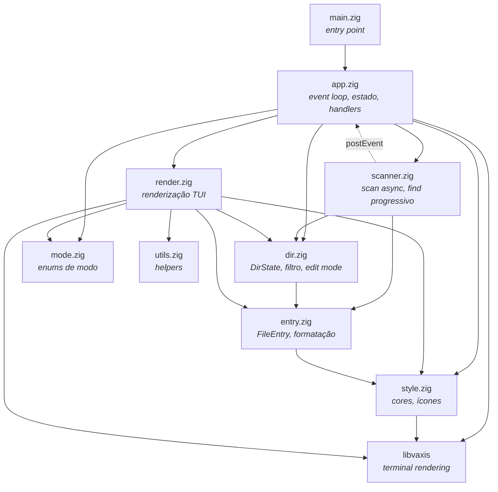
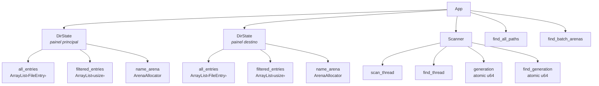
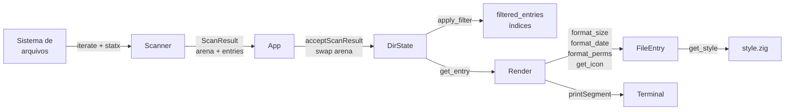
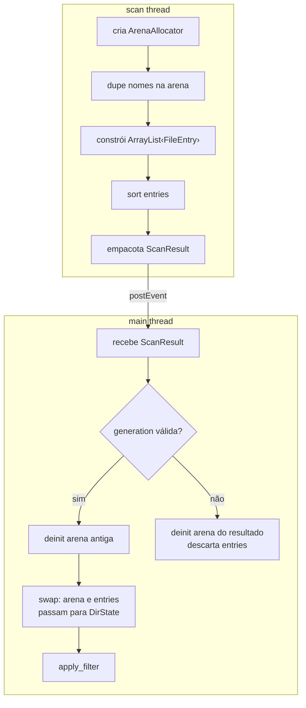
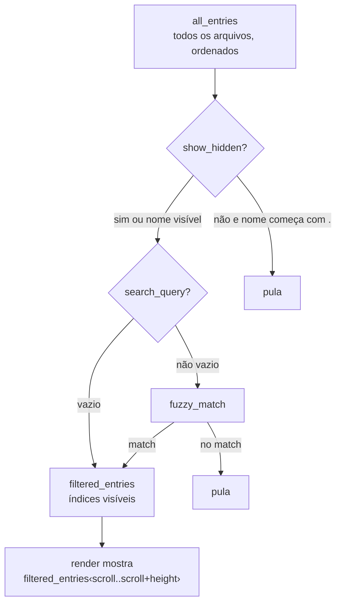

# Arquitetura do xpl-f

## Visão geral dos módulos



## Ownership (quem possui o quê)



## Event loop principal

```mermaid
sequenceDiagram
    participant Main as main thread
    participant Loop as vaxis.Loop
    participant Render as render.zig
    participant TTY as Terminal

    loop cada frame
        Loop->>Main: nextEvent() [bloqueia]
        alt key_press
            Main->>Main: update() → handler por modo
        else winsize
            Main->>Main: resize terminal
        else scan_complete
            Main->>Main: handleScanComplete()
        else find_batch
            Main->>Main: handleFindBatch()
        end
        Main->>Render: draw(estado)
        Render->>TTY: vx.render()
    end
```

## Scan assíncrono (navegação)

```mermaid
sequenceDiagram
    participant User as Usuário
    participant App as app.zig
    participant Scanner as scanner.zig
    participant Thread as scan thread
    participant Loop as vaxis.Loop

    User->>App: Enter (entra no diretório)
    App->>App: requestScanAsync(path, .main)
    App->>App: is_scanning = true
    App->>Scanner: requestScan(path, target, uid, hidden)
    Scanner->>Scanner: generation += 1
    Scanner->>Thread: spawn scanWorker

    Note over App: UI continua responsiva<br>[scanning] na status bar

    Thread->>Thread: openDir → iterate → statx → sort

    alt generation ainda válida
        Thread->>Loop: postEvent(.scan_complete)
        Loop->>App: nextEvent() → scan_complete
        App->>App: handleScanComplete()
        App->>App: dir_state.acceptScanResult()
        App->>App: is_scanning = false
    else usuário navegou para outro lugar
        Thread->>Thread: generation mudou → descarta resultado
        Thread->>Thread: deinit arena, free entries
    end
```

## Find progressivo (busca recursiva)

```mermaid
sequenceDiagram
    participant User as Usuário
    participant App as app.zig
    participant Scanner as scanner.zig
    participant Thread as find thread
    participant Loop as vaxis.Loop

    User->>App: ? (enter find mode)
    App->>Scanner: requestFind(path, hidden, 10000)
    Scanner->>Thread: spawn findWorker
    App->>App: mode = .find, find_walking = true

    loop a cada 200 resultados
        Thread->>Thread: walk → filtrar hidden → acumular batch
        Thread->>Loop: postEvent(.find_batch)
        Loop->>App: handleFindBatch()
        App->>App: append paths + atualizar filtro
        Note over App: Usuário já vê resultados<br>e pode digitar/filtrar
    end

    Thread->>Loop: postEvent(.find_batch, is_final=true)
    Loop->>App: handleFindBatch()
    App->>App: find_walking = false

    alt Escape antes de terminar
        User->>App: Escape
        App->>Scanner: cancelFind()
        Scanner->>Scanner: find_generation += 1
        Scanner->>Thread: join (thread checa generation e sai)
    end
```

## Fluxo de dados do FileEntry



## Transferência de ownership no scan



## Modelo de filtragem



## Resumo de responsabilidades

| Módulo | Responsabilidade | Estado que possui |
|--------|-----------------|-------------------|
| **main.zig** | Entry point, parse de args | Nenhum |
| **app.zig** | Orquestrador: event loop, handlers, estado global | App, cursores, buffers, modos |
| **scanner.zig** | I/O assíncrono em threads separadas | Threads, generation counters |
| **dir.zig** | Estado do diretório: scan síncrono, filtro, edição | Entries, arena, filtros |
| **render.zig** | Renderização (read-only, sem estado) | Nenhum |
| **entry.zig** | Struct FileEntry + formatação | Dados do arquivo |
| **mode.zig** | Enums puros | Nenhum |
| **style.zig** | Constantes de cor e ícones | Nenhum |
| **utils.zig** | Funções utilitárias | Nenhum |
