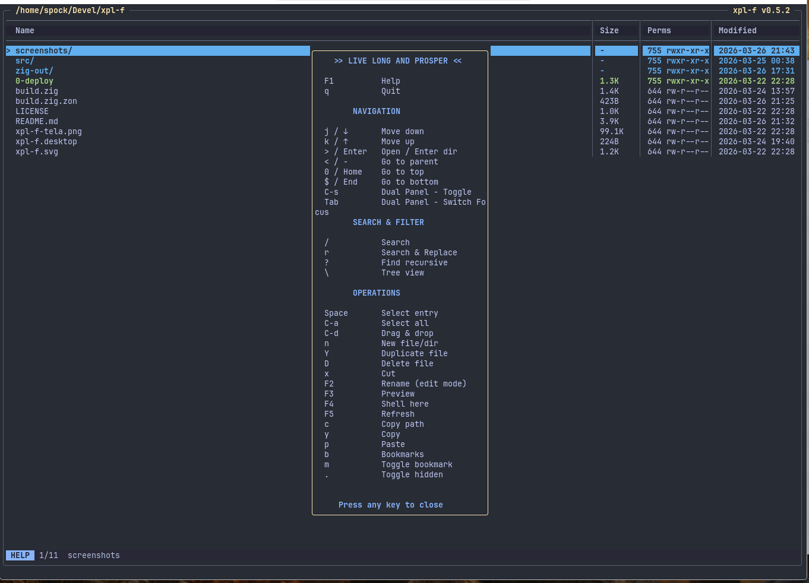
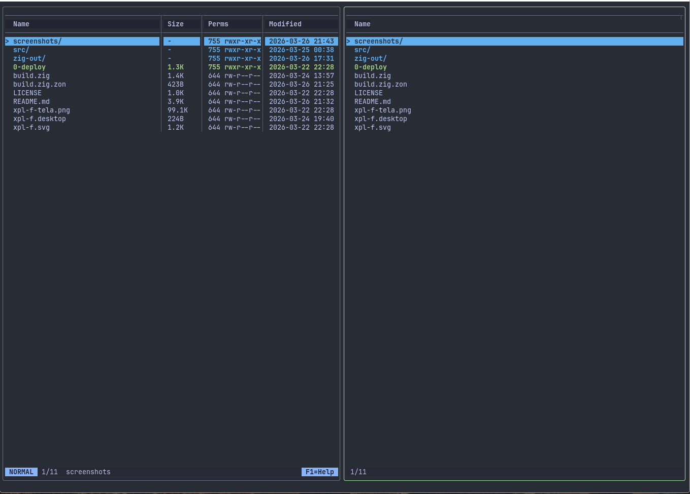

# xpl-f

File explorer TUI, built as a study project for learning Zig.

Written with assistance from Claude Code

<p align="center">
  <br>
  <em>help popup (F1)</em>
</p>

<p align="center">
  <br>
  <em>split panel (Ctrl+S)</em>
</p>

## Stack

- **Zig 0.15** com **libvaxis** (terminal rendering)
- Zero dependências externas além do libvaxis
- Convention over configuration — sem arquivos de config

## Build & Run

```sh
zig build                         # debug build
zig build -Doptimize=ReleaseSmall # release
zig build run                     # run direto
zig build run -- /path/to/dir     # abrir em diretório específico
```

O binário fica em `zig-out/bin/xpl-f`. Deploy script em `xpl-deploy`.

## Arquitetura

```
src/
├── main.zig    # Entry point, parse de args, cria App
├── app.zig     # Core: event loop, input handlers, estado da aplicação
├── render.zig  # Renderização: main window, popups (help, confirm, replace, preview)
├── dir.zig     # Estado do diretório: scan, filtro, edit mode, operações de rename/delete
├── entry.zig   # FileEntry: tipo, ícone, estilo, formatação de size/date, ordenação
├── mode.zig    # Enums: Mode, PendingKey, ReplaceField
└── style.zig   # Paleta de cores (Catppuccin-like), ícones
```

### Fluxo principal

1. `main.zig` cria `App` com allocator e diretório inicial
2. `App.run()` roda o event loop: `nextEvent() → update() → draw() → render()`
3. `update()` despacha key events para handlers por modo (normal, edit, search, replace, confirm, help, preview)
4. `draw()` chama `render.draw()` com o estado atual, usando um frame arena allocator

### Sistema de modos

| Modo | Propósito |
|------|-----------|
| normal | Navegação e comandos |
| edit | Edição inline de nomes de arquivo |
| search | Filtro fuzzy por nome |
| replace | Search & replace em nomes |
| confirm | Confirmação de operações destrutivas |
| help | Popup de ajuda (F1) |
| preview | Preview flutuante de arquivos |

### Keybindings (normal mode)

- `j/k` ou setas: navegar
- `l/Enter`: abrir (texto → $EDITOR, binários → xdg-open)
- `h/-`: diretório pai
- `gg/G`: topo/fim
- `/`: busca
- `r`: search & replace
- `i`: edit mode
- `yy`: copiar para clipboard
- `yl`: copiar path para clipboard do sistema
- `dd`: cortar para clipboard
- `D`: deletar arquivo/seleção
- `p`: colar (paste)
- `t`: duplicar arquivo no local (sufixo -1, -2, ...)
- `Ctrl+l`: preview flutuante
- `.`: toggle hidden files
- `Space`: selecionar
- `Ctrl+a`: selecionar tudo (toggle)
- `gd`: drag & drop via ripdrag (arquivo atual ou seleção)
- `m`: toggle bookmark no diretório atual
- `'`: abrir lista de bookmarks
- `q`: sair

### Preview

- Detecta binários por extensão (~50 formatos), magic bytes e análise de conteúdo
- Arquivos texto: mostra com números de linha, scroll com j/k
- Diretórios: tree view recursivo (até 3 níveis) com conectores
- Binários: mostra `[binary file]`

### Abertura de arquivos

- Extensões binárias (pdf, png, mp4, etc.) → `xdg-open` em background
- Arquivos texto → `$EDITOR` (fallback: vi), saindo temporariamente do alt screen

## Convenções de código

- Arena allocator por frame para alocações temporárias de renderização
- Pending key system para sequências de teclas (gg, dd, yy)
- Child windows do libvaxis para clipping de colunas
- Popups usam `win.child()` com border e `popup.clear()`
- Commit messages em português

## Ideias futuras

- ~~**Bookmarks**: salvar diretórios favoritos, navegar rápido (ex: `m` para marcar, `'` para ir)~~ (implementado: m/'/d)
- ~~**Copiar/mover arquivos**: `cp`/`mv` com seleção múltipla, cut/paste style~~ (implementado: yy/dd/p)
- **Syntax highlighting no preview**: colorir código por linguagem no popup de preview
- **Tabs ou split panes**: múltiplos diretórios abertos simultaneamente
